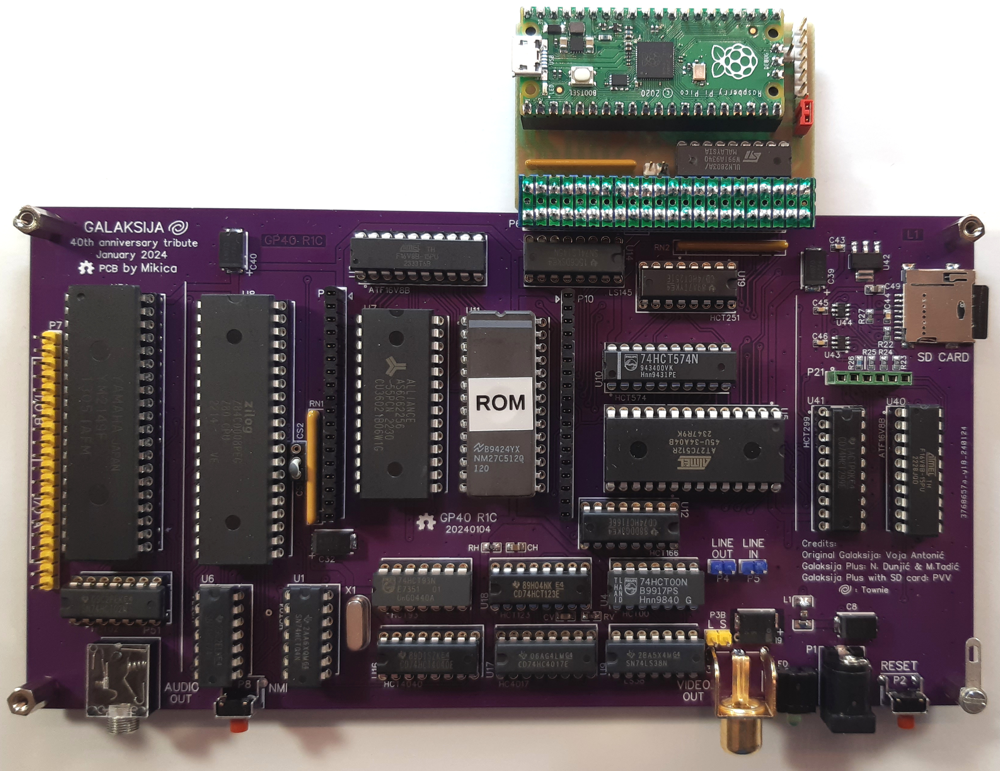
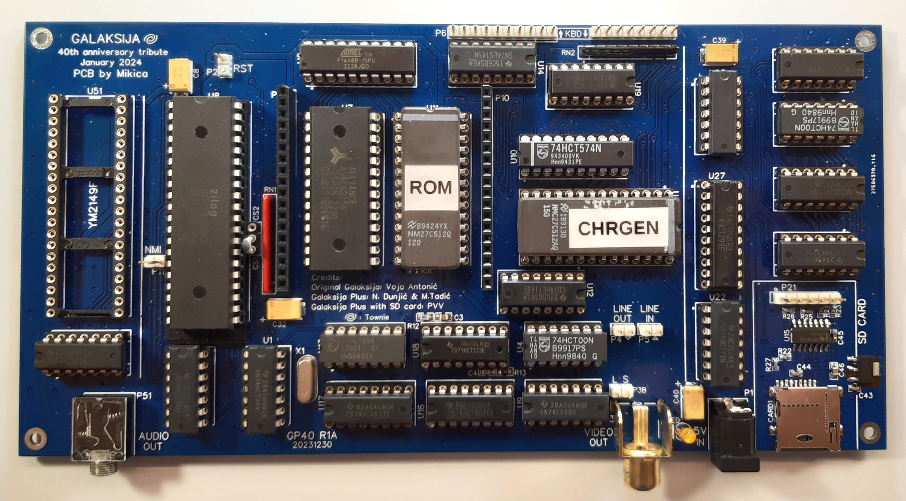

# Galaksija 40th Anniversary Tribute

This Galaksija Plus mod is based on PVV's clone from 2017
with the following modifications:

- USB HID keyboard/mouse/gamepad interface using RPI Pico
- a keyboard (optional) stackable either on the upper or the bottom side
- proper composite video output (no need to reduce the power in voltage)
- added an optional bus contention remover
- address decoder with ATF16V8B or g16v8s equivalent
  which provides a configurable MEMRQ map with 1 kB granularity
- improved SD hardware (SD now runs on the CPU clock)
- SD DOS version 8.12
- integrated micro SD socket with 3.3V PS and LVTTL level shifters
- integrated audio interface
- two I/O ports connected to the audio interface
- NMI reset circuit
- hybrid TH/SMD PCB (SMD discrete components on the bottom side)
- board dimensions 100 mm x 190 mm

## Specifications

- Z80A CPU at 3.072 MHz, 32 kB ROM (16k used), 32 kB static RAM
- Text mode 32x16 characters, monochrome
- Graphics mode: 256x208 pixels
- Storage: cassette tape (280 or 1200 bit/s) 
  MicroSD card (up to 4 GB) with SDOS
- Sound: 3 channels + white noise provided by AY-3-8910 or YM2149F
- I/O ports: two 8-bit parallel ports
- USB HID keyboard/mouse interface (as add-on)
- Power consumption: less than 250 mA at 5V 

## Firmware

- `GP40_U11_ROM.bin`, ROM 1-4, fits EPROM 27C128-27C512
- `GP40_U5_CHRGEN.bin`, character generator, fits EPROM 27C64-27C512
- `GP40_U2.jed`, address decoder, fits g16v8s
- `GP40_U40.jed`, SD interface, fits g16v8ms
- `GP40_U2.lgc` and `GP40_U40.lgc`, test vectors for XGecu Pro programmers

## Hardware memory map

```
  $0000...$0FFF  ROM A or 1: 4 kB (bootstrap and BASIC)
  $1000...$1FFF  ROM B or 2: 4 kB (math functions, etc.)
  $2000...$27FF  Keyboard and latch
  $2800...$BFFF  RAM: 30 kB ($2800...$2BFF Video RAM)
  $C000...$C7FF  RAM: 2 kB (used by SDOS)
  $C800...$CFFF  SD HWM PVV interface: 2 kB
  $D000...$DFFF  Unused, 4 kB (routed to CS on the expansion bus)
  $E000...$EFFF  ROM 3: 4 KB (Galaksija Plus, graphics)
  $F000...$FFFF  ROM 4: 4 KB (SD DOS)
```

## Credits
 
- Voja Antonic: Galaksija (1983)
- Nenad Dunjic and Milan Tadic: Galaksija Plus mod (1985)
- PVV and Fifan: Galaksija Plus clone with SD card (2016)
  http://www.nedopc.org/forum/viewtopic.php?p=87313
- Goran Stankovic (YT2FSG):  Retro Computers web page
  https://www.qsl.net/yt2fsg/galaksija/galaksija_clone.html
- Retro Bertie (@MacBerti28): YouTube guide
 
## Soldering sequence
 
  1. start with the SMD components on the bottom side
     (the SMD components are 0805+ and easy to solder)
  2. solder the SMD components on the top side
  3. solder the IC sockets
  4. solder the rest of the TH components

# Subprojects

## LTspice_composite_video

Simulations for adjustment of the composite video impedance maching
and amplification (i.e. output signal levels).

## LTspice_SD_interface

Simulations for the optimized SD interface.

## SDOS_V8C_GP40

Contains SD DOS version v8.12 that supports the optimized SD interface 
(with one g16v8ms and one 74HCT299).

## Add-ons

- Pico_USB_HID, USB HID (keyboard/mouse/gamepad) interface
- PS2_KBD, PS/2 interface
- Keyboard MX Cherry keyboard

## PCB Images

PCB release R1C and R1D



PCB release R1A



